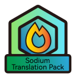
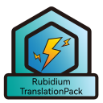
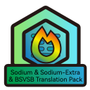

 
 
 
 <h2 align="center">Sodium Translation Pack</h2>
 
Translation resource packs for Sodium and its affiliates and Forge branches. 

English / [简体中文](README.md)

## What's this ?

Translation resource packs for Sodium and its affiliates and Forge branches .

Localization is supported in [CaffeineMC / sodium-fabric](https://github.com/CaffeineMC/sodium-fabric) Pull [#100](https://github.com/CaffeineMC/sodium-fabric/pull/100) [#517](https://github.com/CaffeineMC/sodium-fabric/pull/517) [#717](https://github.com/CaffeineMC/sodium-fabric/pull/717) and integrated into 
[CaffeineMC / sodium-fabric](https://github.com/CaffeineMC/sodium-fabric) / [1.17.x / dev](https://github.com/CaffeineMC/sodium-fabric/tree/1.17.x/dev) . 
However , the translation on [Crowdin](https://crowdin.com/translate/sodium-fabric) is not moved into the Sodium .

(It is possible to stop updating sodium translation,  [Sodium Translation Project](https://gist.github.com/amnotbananaama/6cfd6ce27e3258d50db6a4fd9291aa94) )

### Mod & Game Version support :

|          ResourcePack Name          |                          Mod Support                          | Game Version Support | ModLoader |
| :---------------------------------: | :-----------------------------------------------------------: |:--------------------:| :-------: |
| BSVSB&Sodium&SodiumExtraTranslation |  Sodium & Sodium-Extra & Better Sodium Video Settings Button  |   1.16.x ~ 1.19.x    |  Fabric  |
|         RubidiumTranslationPack         |                      Rubidium                     |   1.16.x ~ 1.19.x    |   Forge   |

### Thanks :

[Sodium](https://github.com/jellysquid3/sodium-fabric) author: **JellySquid**

[Chlorine](https://github.com/HalogenMods/Chlorine) author: **hanetzer**

[Halogen](https://github.com/spoorn/sodium-forge) author: **sporn**

[Magnesium](https://github.com/Someone-Else-Was-Taken/Magnesium) author: **someoneelsewastaken**

[Rubidium](https://github.com/Asek3/Rubidium) author: **Asek3**

[Sodium-Extra](https://github.com/FlashyReese/sodium-extra-fabric) author: **Flashy Reese**

[Better Sodium Video Settings Button](https://github.com/LimeShulkerBox/better-sodium-video-settings) author: **LimeShulkerBox**

**MojangStudio**

 This Resource Pack is licensed under a <a rel="license" href="http://creativecommons.org/licenses/by-nc-sa/4.0/">Creative Commons Attribution-NonCommercial-ShareAlike 4.0 International License</a>.

