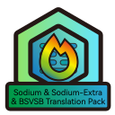

 
 
 
 <h2 align="center">Sodium Translation Pack</h2>
 
Sodium及其附属和Forge分支的翻译资源包

[English](README-EN.md) / 简体中文

由于Sodium作者不接受语言文件的PR，所以制作了此资源包。
(有可能停止更新Sodium翻译，详见 [Sodium Translation Project - 简体中文说明](https://gist.github.com/TexBlock/1f5628574b1d6cd7df7243c8bcc552c6) )

### 模组及游戏版本支持

|                  材质包名称                  |                            支持模组                             |     游戏版本支持      | 模组加载器  |
|:---------------------------------------:|:-----------------------------------------------------------:|:---------------:|:------:|
| BSVSB&Sodium&SodiumExtraTranslationPack | Sodium & Sodium-Extra & Better Sodium Video Settings Button | 1.16.x ~ 1.19.x | Fabric |
|  Rubidium&RubidiumExtraTranslationPack  |                  Rubidium & Rubidium-Extra                  | 1.16.x ~ 1.19.x | Forge  |

> 
> Magnesium/Rubidium Extras 本地化 : [ForgeModi18n/MgRb-Extras-i18n](https://github.com/ForgeModi18n/MgRb-Extras-i18n)
> 
> Magnesium/Rubidium DynamicLights 本地化 : [ForgeModi18n/MgRbDynamicLights-i18n](https://github.com/ForgeModi18n/MgRbDynamicLights-i18n)

### 感谢

[Sodium](https://github.com/jellysquid3/sodium-fabric) 作者: **JellySquid**

[Chlorine](https://github.com/HalogenMods/Chlorine) 作者: **hanetzer**

[Halogen](https://github.com/spoorn/sodium-forge) 作者: **spoorn**

[Magnesium](https://github.com/Someone-Else-Was-Taken/Magnesium) 作者: **SomeOneElseWasTaken**

[Rubidium](https://github.com/Asek3/Rubidium) 作者: **Asek3**

[Sodium-Extra](https://github.com/FlashyReese/sodium-extra-fabric) 作者: **FlashyReese**

[Rubidium-Extra](https://www.curseforge.com/minecraft/mc-mods/sodium-extra-forge) 作者：**dimadencep**

[Better Sodium Video Settings Button](https://github.com/LimeShulkerBox/better-sodium-video-settings) 作者: **LimeShulkerBox**

使用 [CFPAOrg/Minecraft-Mod-Language-Package](https://github.com/CFPAOrg/Minecraft-Mod-Language-Package) 仓库内的自动打包（遵循[CC-BY-NC-SA](http://creativecommons.org/licenses/by-nc-sa/4.0/)协议）

**MojangStudio**

 本资源包采用<a rel="license" href="http://creativecommons.org/licenses/by-nc-sa/4.0/">知识共享署名-非商业性使用-相同方式共享 4.0 国际许可协议</a>进行许可。

