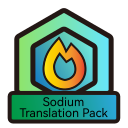

 
 
 
 <h2 align="center">Sodium Translation Pack</h2>
 
Sodium及其附属和Forge分支的翻译资源包

[English](README-EN.md) / 简体中文

在 [CaffeineMC/sodium-fabric](https://github.com/CaffeineMC/sodium-fabric) PR [#100](https://github.com/CaffeineMC/sodium-fabric/pull/100) 、 [#517](https://github.com/CaffeineMC/sodium-fabric/pull/517) 、[#717](https://github.com/CaffeineMC/sodium-fabric/pull/717)
对本地化进行了支持并被合并到 [CaffeineMC/sodium-fabric](https://github.com/CaffeineMC/sodium-fabric) / [1.17.x/dev](https://github.com/CaffeineMC/sodium-fabric/tree/1.17.x/dev) 分支,
但由于作者未将 [Crowdin](https://crowdin.com/translate/sodium-fabric) 上的翻译移动到模组内,此材质包提供了简体中文翻译。
(有可能停止更新Sodium翻译，详见 [Sodium Translation Project - 简体中文说明](https://gist.github.com/TexBlock/1f5628574b1d6cd7df7243c8bcc552c6) )

### 模组及游戏版本支持

|               材质包名称               |                          支持模组                          |     游戏版本支持      | 模组加载器 |
| :-------------------------------------: | :---------------------------------------------------------: |:---------------:| :--------: |
| BSVSB&Sodium&SodiumExtraTranslationPack | Sodium & Sodium-Extra & Better Sodium Video Settings Button | 1.16.x ~ 1.19.x |   Fabric   |
|           RubidiumTranslationPack           |                     Rubidium                     | 1.18.x ~ 1.19.x |   Forge   |

> Sodium及其附属 1.16.x 翻译: [【Sodium】钠模组汉化 游戏帧数优化三件套 - 哔哩哔哩专栏](https://www.bilibili.com/read/cv6832123/)
>
> Magnesium及其附属 1.16.x 翻译: [Molarczsq/Magnesium-should-be-in-Chinese](https://github.com/Molarczsq/Magnesium-should-be-in-Chinese/releases)
> 
> Magnesium/Rubidium Extras 本地化 : [ForgeModi18n/MgRb-Extras-i18n](https://github.com/ForgeModi18n/MgRb-Extras-i18n)
> 
> Magnesium/Rubidium DynamicLights 本地化 : [ForgeModi18n/MgRbDynamicLights-i18n](https://github.com/ForgeModi18n/MgRbDynamicLights-i18n)

### 感谢

[Sodium](https://github.com/jellysquid3/sodium-fabric) 作者: **JellySquid**

[Chlorine](https://github.com/HalogenMods/Chlorine) 作者: **hanetzer**

[Halogen](https://github.com/spoorn/sodium-forge) 作者: **spoorn**

[Magnesium](https://github.com/Someone-Else-Was-Taken/Magnesium) 作者: **someoneelsewastaken**

[Rubidium](https://github.com/Asek3/Rubidium) 作者: **Asek3**

[Sodium-Extra](https://github.com/FlashyReese/sodium-extra-fabric) 作者: **FlashyReese**

[Better Sodium Video Settings Button](https://github.com/LimeShulkerBox/better-sodium-video-settings) 作者: **LimeShulkerBox**

**MojangStudio**

 本资源包采用<a rel="license" href="http://creativecommons.org/licenses/by-nc-sa/4.0/">知识共享署名-非商业性使用-相同方式共享 4.0 国际许可协议</a>进行许可。

